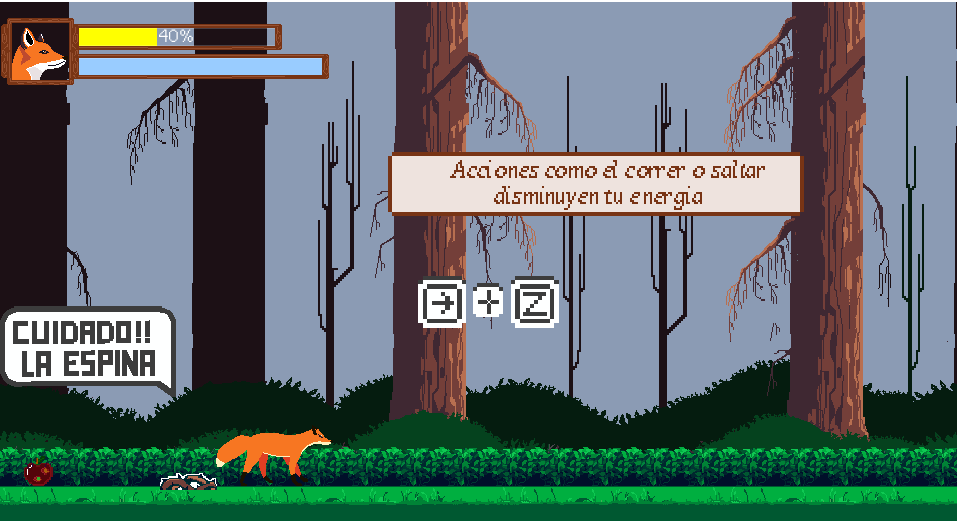
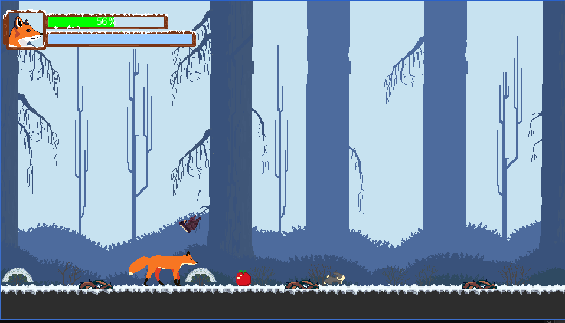
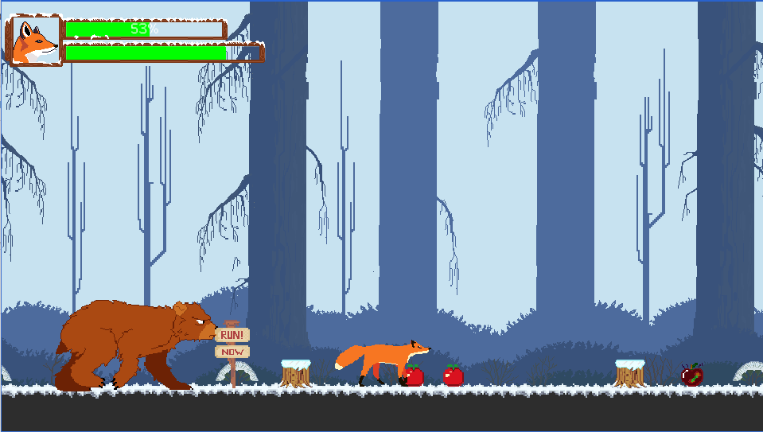
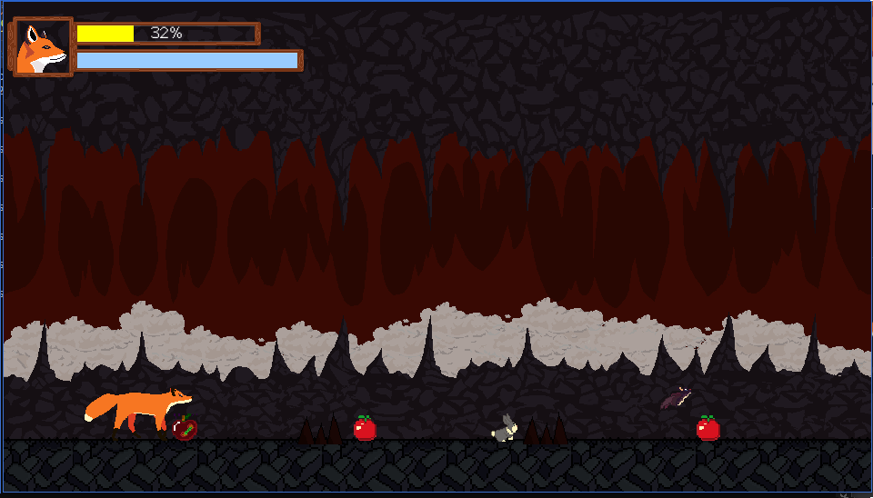

# Sonder Game
A game made for the National Videogame Contest - Peru Lima 2018 🇵🇪🦊

[](http://doge.mit-license.org)


Synopsis:

Sonder is a fox who lost his family at the hands of a hunter, being alone, he had to fend for himself. It's been 1 year since that day and nothing is like before. Food is scarce, forests are cut down and river water is polluted.
Winter is coming and in order to survive, our friend will have to undertake a journey north in search of food.


|     |     |
| :-: | :-: |
|  Menu Game | Main Character |
|     |      |


## Screenshots

|     |     |
| :-: | :-: |
|  Tutorial Game | Snow Level |
|     |      |
| Bear Enemy  |  Cave Game|
|   |        |


[Lua](http://www.lua.org/) script that makes [LÖVE](https://www.love2d.org/) game release easier (previously
Bash script).\
Automates LÖVE [Game Distribution](https://www.love2d.org/wiki/Game_Distribution).\
LÖVE [forum topic](https://love2d.org/forums/viewtopic.php?t=75387).

### Prerequisites

What things you need to install the software and how to install them. Install [Loved2d](https://love2d.org/) in Ubuntu Linux.

```
sudo add-apt-repository ppa:bartbes/love-stable
sudo apt-get update
```
Install [Loved2d](https://love2d.org/) in Windows 10 [here](https://www.planimeter.org/grid-sdk/tutorials/Getting_Started).
## Installation

To run this project on your own, do the following: 
1. Clone this project.
```
git clone https://github.com/senior-gato/Sonder.git
```

2. Run the project using `love src` on your favorite terminal.
```
love src
```

For help getting started with Love2d, view our
[online documentation](https://love2d.org/wiki/Getting_Started), which offers tutorials,
samples, guidance on LÖVE.

## Contributing
Pull requests are welcome. For major changes, please open an issue first to discuss what you would like to change.

Please make sure to update tests as appropriate.

## License
[License MIT](https://choosealicense.com/licenses/mit/)
